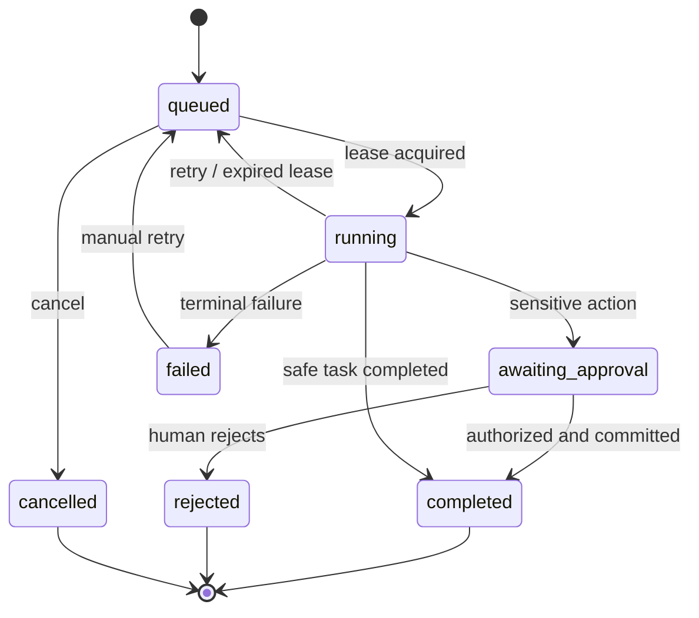

# Durable Run State Machine

```mermaid
stateDiagram-v2
 [*] --> queued
 queued --> running: lease acquired
 running --> queued: retry / expired lease
 running --> awaiting_approval: sensitive action
 awaiting_approval --> completed: authorized and committed
 awaiting_approval --> rejected: human rejects
 running --> completed: safe task completed
 running --> failed: terminal failure
 failed --> queued: manual retry
 queued --> cancelled: cancel
 completed --> [*]
 rejected --> [*]
 cancelled --> [*]
```

TODO: state versioning, heartbeat, workflow history and reconciliation for unknown external effects.
