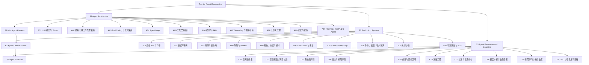

# 1. Skill Roadmap

```mermaid
flowchart TD
 T[Top-tier Agent Engineering] --> S1[S1 Agent Architecture]
 T --> S2[S2 Production Systems]
 T --> S3[S3 Agent Evaluation and Learning]
 S1 --> A01["A01 LLM 接口与 Token"]
 S1 --> A02["A02 结构化输出与类型校验"]
 S1 --> A03["A03 Tool Calling 与工具路由"]
 S1 --> A04["A04 Agent Loop"]
 S1 --> A05["A05 工具契约设计"]
 S1 --> A06["A06 检索与 RAG"]
 S1 --> A07["A07 Grounding 与引用校验"]
 S1 --> A08["A08 上下文工程"]
 S1 --> A09["A09 记忆与状态"]
 S1 --> A10["A10 Planning、MCP 与多 Agent"]
 S2 --> B01["B01 后端 API 与异步"]
 S2 --> B02["B02 数据库事务"]
 S2 --> B03["B03 幂等与副作用"]
 S2 --> B04["B04 队列与 Worker"]
 S2 --> B05["B05 租约、重试与超时"]
 S2 --> B06["B06 Checkpoint 与恢复"]
 S2 --> B07["B07 Human-in-the-Loop"]
 S2 --> B08["B08 身份、权限、租户隔离"]
 S2 --> B09["B09 执行沙箱"]
 S2 --> B10["B10 可观测性与 SLO"]
 S3 --> C01["C01 任务数据集"]
 S3 --> C02["C02 任务真值与环境状态"]
 S3 --> C03["C03 轨迹级评测"]
 S3 --> C04["C04 安全与权限评测"]
 S3 --> C05["C05 统计与置信区间"]
 S3 --> C06["C06 消融实验"]
 S3 --> C07["C07 成本与延迟优化"]
 S3 --> C08["C08 错误分析与数据挖掘"]
 S3 --> C09["C09 示范学习与偏好数据"]
 S3 --> C10["C10 DPO 与强化学习基础"]
 S1 --> P1[P1 Mini Agent Harness]
 S2 --> P2[P2 Agent Cloud Runtime]
 S3 --> P3[P3 Agent Eval Lab]
 P1 --> P2 --> P3
```

索引：[SKILL_MATRIX](../../SKILL_MATRIX.md)。
