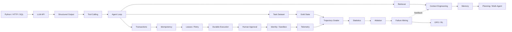

# 2. Concept Roadmap

```mermaid
flowchart LR
 P[Python / HTTP / SQL] --> A01[LLM API]
 A01 --> A02[Structured Output] --> A03[Tool Calling] --> A04[Agent Loop]
 A04 --> A06[Retrieval] --> A08[Context Engineering] --> A09[Memory] --> A10[Planning / Multi-Agent]
 A04 --> B02[Transactions] --> B03[Idempotency] --> B05[Leases / Retry] --> B06[Durable Execution]
 B06 --> B07[Human Approval] --> B08[Identity / Sandbox] --> B10[Telemetry]
 A04 --> C01[Task Dataset] --> C02[Gold State] --> C03[Trajectory Grader] --> C05[Statistics]
 C05 --> C06[Ablation] --> C08[Failure Mining] --> C10[DPO / RL]
 B10 --> C03
 C08 -. feedback .-> A08
```

学习时持续回答：哪个前置概念为下一个概念提供数据、状态或正确性保证？
