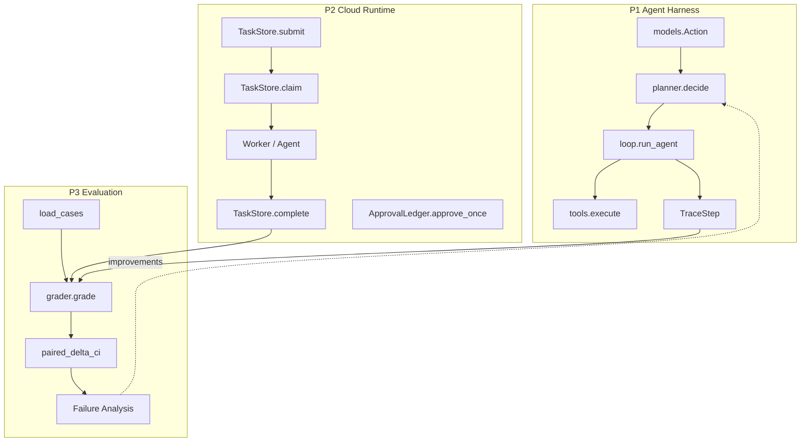

# 3. Code Roadmap

```mermaid
flowchart TB
 subgraph P1[P1 Agent Harness]
 A[models.Action] --> B[planner.decide]
 B --> C[loop.run_agent]
 C --> D[tools.execute]
 C --> E[TraceStep]
 end
 subgraph P2[P2 Cloud Runtime]
 F[TaskStore.submit] --> G[TaskStore.claim]
 G --> H[Worker / Agent]
 H --> I[TaskStore.complete]
 J[ApprovalLedger.approve_once]
 end
 subgraph P3[P3 Evaluation]
 K[load_cases] --> L[grader.grade]
 L --> M[paired_delta_ci]
 M --> N[Failure Analysis]
 end
 E --> L
 I --> L
 N -. improvements .-> B
```

源码入口见 [Projects](../../projects/README.md)。
