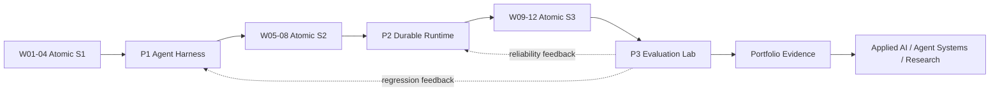

# 4. Project Roadmap

```mermaid
flowchart LR
 W01[W01-04 Atomic S1] --> P1[P1 Agent Harness]
 P1 --> W05[W05-08 Atomic S2] --> P2[P2 Durable Runtime]
 P2 --> W09[W09-12 Atomic S3] --> P3[P3 Evaluation Lab]
 P3 --> E[Portfolio Evidence]
 E --> J[Applied AI / Agent Systems / Research]
 P3 -. regression feedback .-> P1
 P3 -. reliability feedback .-> P2
```

每周细化见 [ROADMAP](../../ROADMAP.md) 和 [weeks](../../weeks/README.md)。
